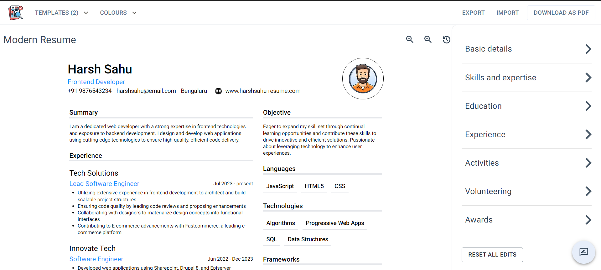

# ResumeX

[](LICENSE)
[](package.json)
[](#)

resumeX streamlines resume creation, customization, and management. It offers a modern, intuitive, and responsive user interface.

## Features

- Streamlined resume creation process
- Customizable resume templates
- Intuitive and responsive UI
- Integration with modern web technologies

## Demo

Check out the live demo [here](https://resume-x-ten.vercel.app).

## Getting Started

### Prerequisites

Ensure you have the following installed:

- Node.js
- npm or yarn

### Installation

Clone the repository:

```bash
git clone https://github.com/manav-gopal/resumeX.git
cd resumeX
```
Install dependencies

```bash
npm install
# or
yarn install
```

### Running Locally
```bash
npm run dev
# or
yarn dev
# or
pnpm dev
# or
bun dev
```
Open http://localhost:3000 with your browser to see the result.

### Screenshots
#### Home Page

#### Builder Page


### Usage
You can start editing the page by modifying `app/page.tsx`. The page auto-updates as you edit the file.

### Deployment
The easiest way to deploy your Next.js app is to use the Vercel Platform from the creators of Next.js.

### Learn More
To learn more about Next.js, take a look at the following resources:

- `Next.js Documentation` - learn about Next.js features and API.
- `Learn Next.js` - an interactive Next.js tutorial.

You can check out the `Next.js GitHub repository` - your feedback and contributions are welcome!

### Contributing
Contributions are what make the open source community such an amazing place to learn, inspire, and create. Any contributions you make are greatly appreciated.

1. Fork the Project
2. Create your Feature Branch (git checkout -b feature/AmazingFeature)
3. Commit your Changes (git commit -m 'Add some AmazingFeature')
4. Push to the Branch (git push origin feature/AmazingFeature)
5. Open a Pull Request
6. License
7. Distributed under the MIT License. See LICENSE for more information.

### Contact

Manav Gopal - [manav-gopal](https://www.linkedin.com/in/manav-gopal/)

### Acknowledgments
- Next.js
- Vercel
- Tailwind CSS
- TypeScript

Feel free to customize this template further with additional information specific to your project.